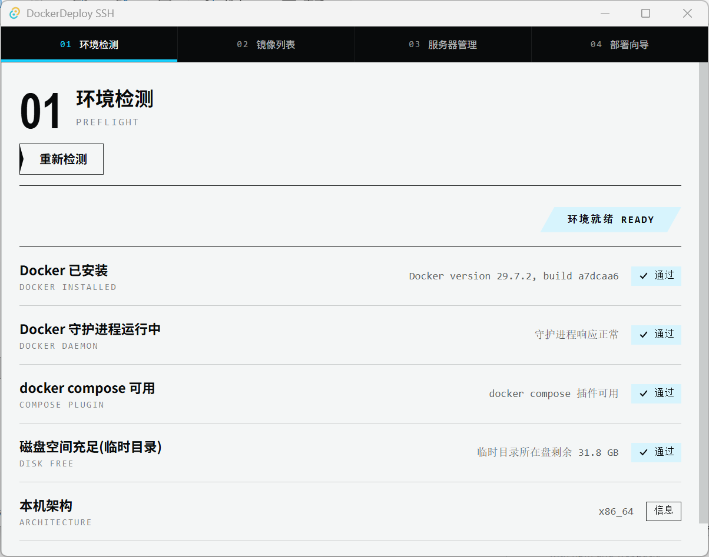
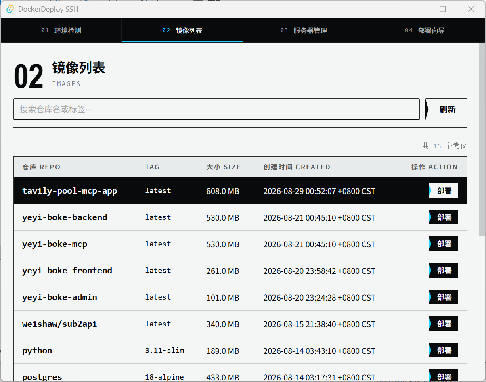
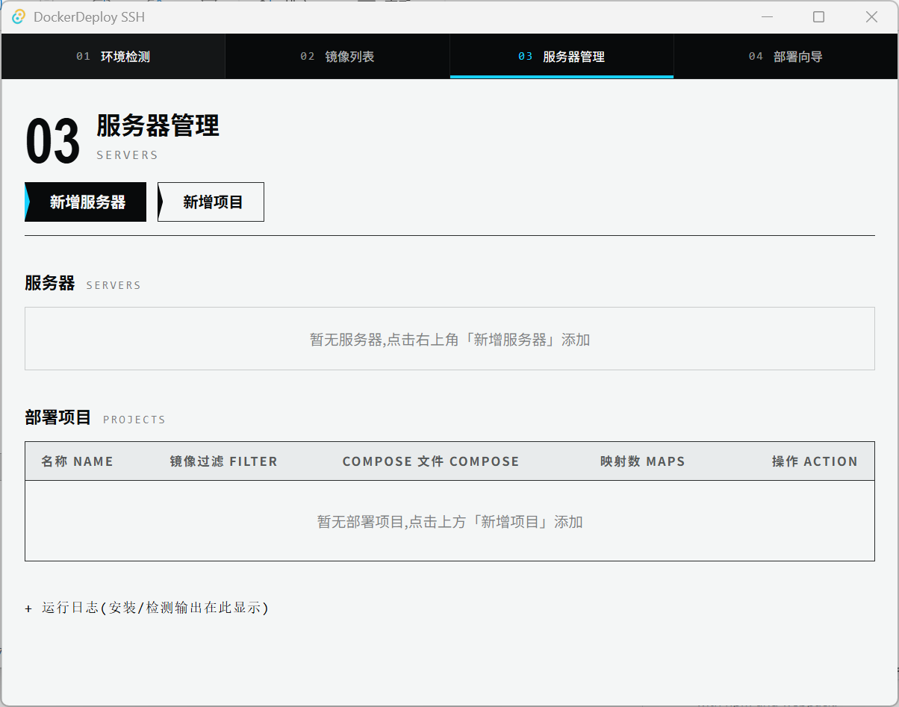
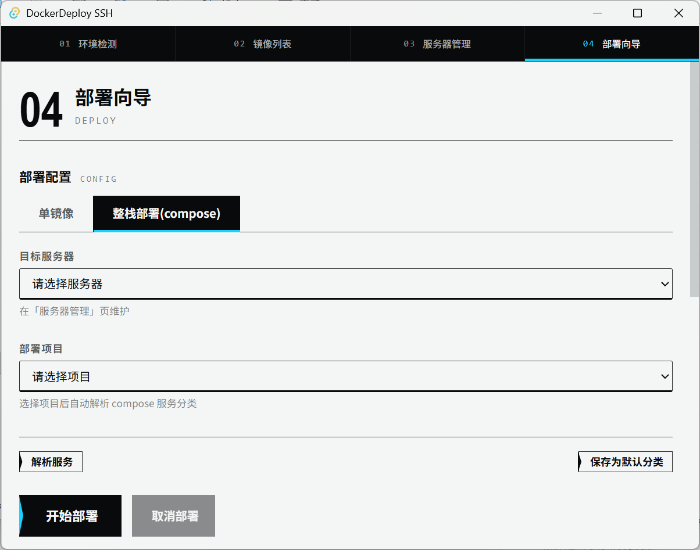
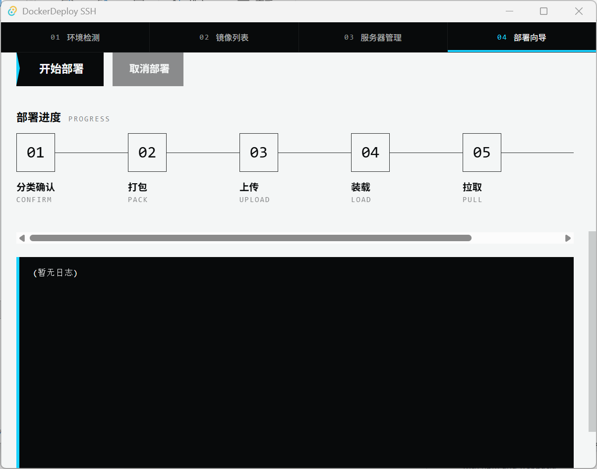

# DockerDeploy SSH

Windows 桌面客户端(Tauri 2):把本地构建的 Docker 镜像一键部署到自己的生产服务器——`docker save → gzip → SFTP → docker load → compose up`,不依赖第三方镜像仓库与 CI/CD。支持单镜像与 compose 整栈两种部署模式。

## 文档

**完整项目文档在 [wiki/](wiki/README.md)** ——新会话/新成员从 [wiki/README.md](wiki/README.md) 读起,即可理解架构、模块、契约、构建与部署全貌。











## 快速开始

```bash
npm install          # 仅装 @tauri-apps/cli
npm run tauri dev    # 开发运行
npm run tauri build  # 发布构建(NSIS 安装包)
```

前置要求与详细说明见 [wiki/05-构建与运行.md](wiki/05-构建与运行.md)。

## Compose 文件路径说明

项目配置中的 compose 路径支持两种形式：

- 本地 compose 文件路径（例如 `E:\\apps\\myapp\\docker-compose.yml`）：部署时会先上传到服务器的项目目录，并使用远端 `docker-compose.yml` 启动。
- 已存在项目的远端相对路径（例如 `docker-compose.yml`）：继续按原配置直接使用，兼容旧项目。

本地 Windows 路径不会直接传给服务器执行；如果路径对应的本地文件不存在，部署会在本地明确提示错误。
