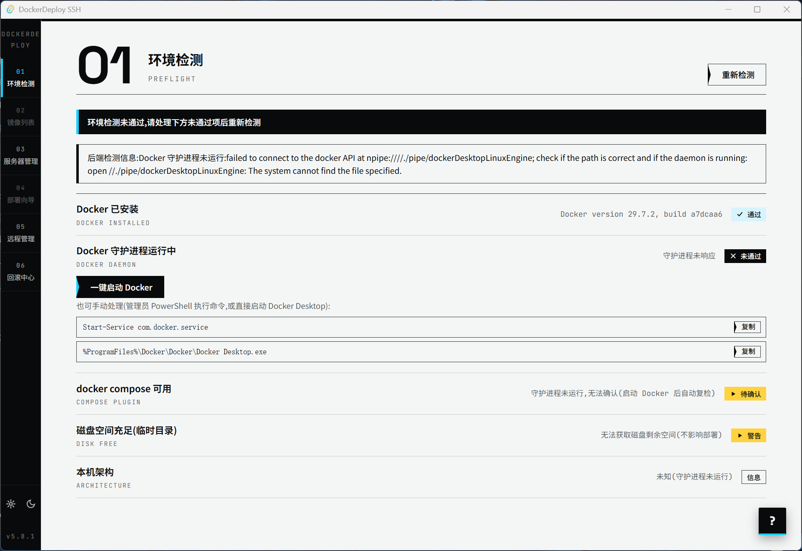
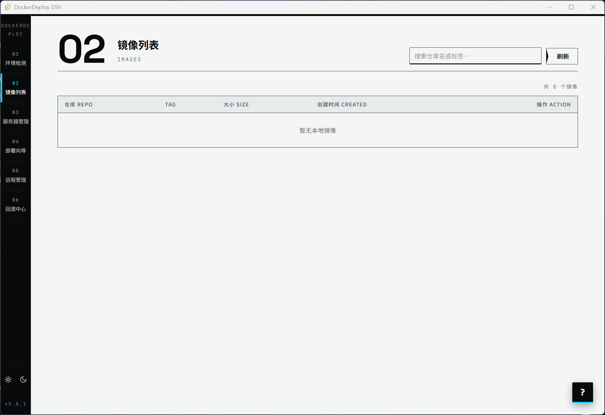
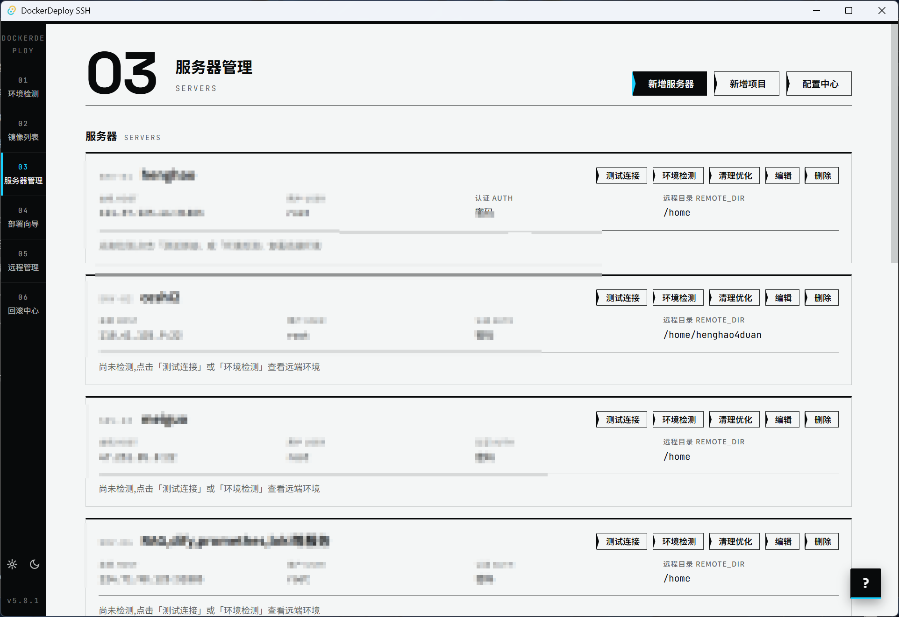
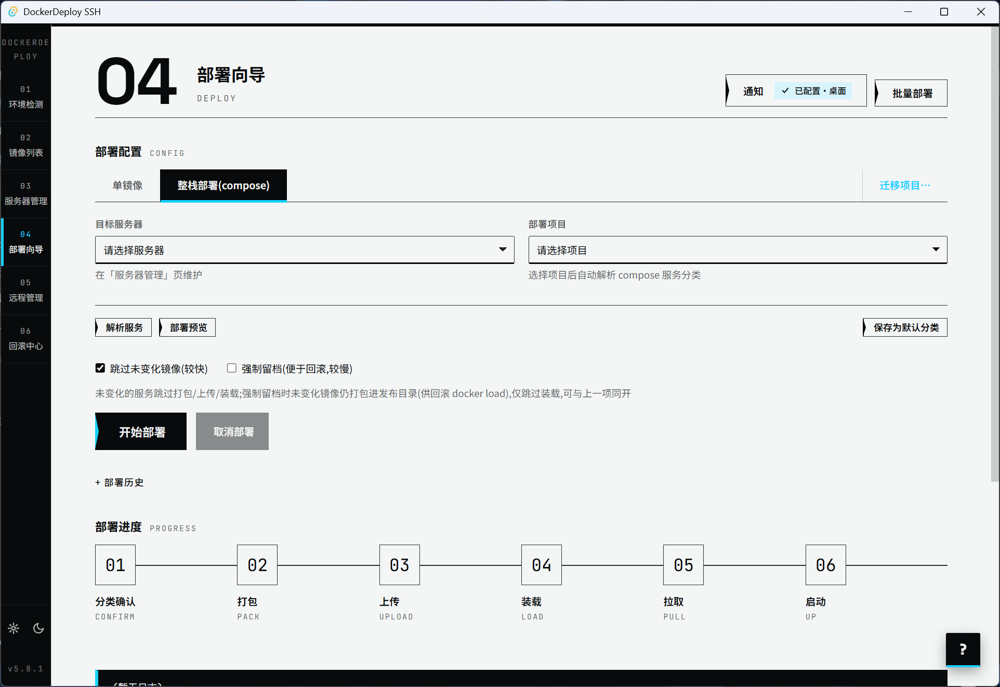
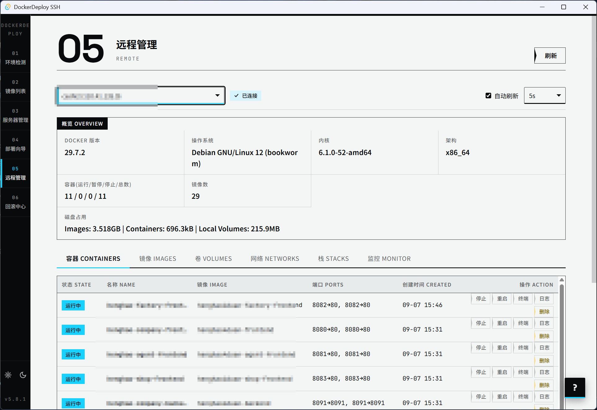
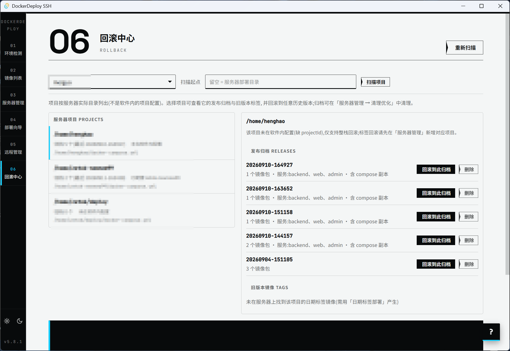

# DockerDeploy SSH

Windows 桌面客户端(Tauri 2):把本地构建的 Docker 镜像一键部署到自己的生产服务器——`docker save → gzip → SFTP → docker load → compose up`,不依赖第三方镜像仓库与 CI/CD。支持单镜像与 compose 整栈两种部署模式。

## 界面一览

按左侧 dock 的 6 个页面依次介绍:

**01 环境检测 PREFLIGHT** —— 启动即自动检查本机 Docker / compose / 磁盘;未通过项给出一键启动按钮或可复制的安装命令,通过后解锁部署相关页面。



**02 镜像列表 IMAGES** —— 本地镜像一览(仓库名 / 标签 / 大小 / 创建时间),支持搜索过滤,一键送入部署向导。



**03 服务器管理 SERVERS** —— 服务器与部署项目集中维护:SSH 三种认证(密码 / 私钥 / 加密私钥口令,密码 DPAPI 加密存储,主机密钥 TOFU 校验);compose 文件导入与文件映射;一键测试连接 / 远程环境检测 / 清理优化;配置中心(口令加密导出 / 导入 / 一键清除)。



**04 部署向导 DEPLOY** —— 单镜像与整栈(compose)两种模式;智能传输(远端镜像 ID 一致自动跳过)、服务分类(本地传输 / 服务器拉取)、部署预览 dry-run;断点续传(失败从步骤 N 继续)、多服务器批量部署、项目跨服务器迁移;五步 / 六步进度校准仪实时可视,全程日志面板。



**05 远程管理 REMOTE** —— 经 SSH 管理服务器上的容器 / 镜像 / 卷 / 网络 / Compose 栈;实时监控(CPU / 内存阈值告警)、PTY 交互终端、日志实时跟随、跨服务器镜像迁移,支持自动刷新。



**06 回滚中心 ROLLBACK** —— 按服务器真实目录列出所有项目与发布归档(不依赖软件内配置),一键回滚到任意历史版本;每个版本可写**版本说明**(类 GitHub Release 的标题 + 描述,存于服务器归档目录),点击归档行即可查看;支持逐版本删除。



**配套能力**:部署历史持久化与一键回滚、通知中心(桌面 + SMTP 邮件)、设置中心(系统托盘 / 亮暗主题跟随系统 / 应用内自动更新——检查更新后弹出更新内容,确认即全自动下载安装重启)、全站帮助(13 章节)。

## 文档

**完整项目文档在 [wiki/](wiki/README.md)** ——新会话/新成员从 [wiki/README.md](wiki/README.md) 读起,即可理解架构、模块、契约、构建与部署全貌。

## 快速开始

```bash
npm install          # 仅装 @tauri-apps/cli
npm run tauri dev    # 开发运行
npm run tauri build  # 发布构建(NSIS 安装包)
```

前置要求与详细说明见 [wiki/05-构建与运行.md](wiki/05-构建与运行.md)。

## Compose 文件路径说明

项目配置中的 compose 路径支持两种形式：

- 本地 compose 文件路径（例如 `E:\\apps\\myapp\\docker-compose.yml`）：部署时会先上传到服务器的项目目录，并使用远端 `docker-compose.yml` 启动。
- 已存在项目的远端相对路径（例如 `docker-compose.yml`）：继续按原配置直接使用，兼容旧项目。

本地 Windows 路径不会直接传给服务器执行；如果路径对应的本地文件不存在，部署会在本地明确提示错误。
